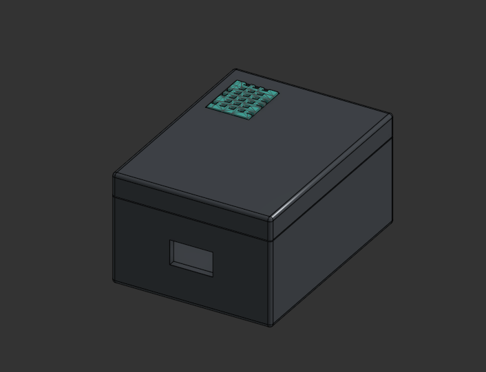
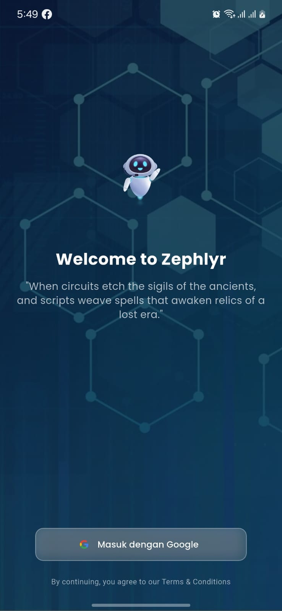
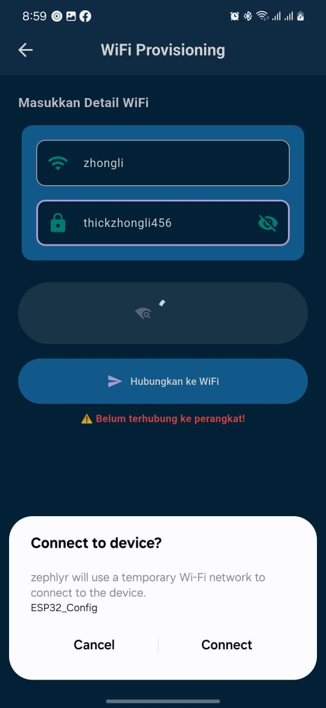
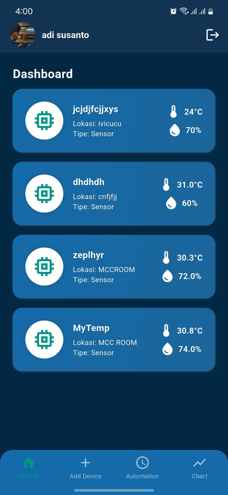
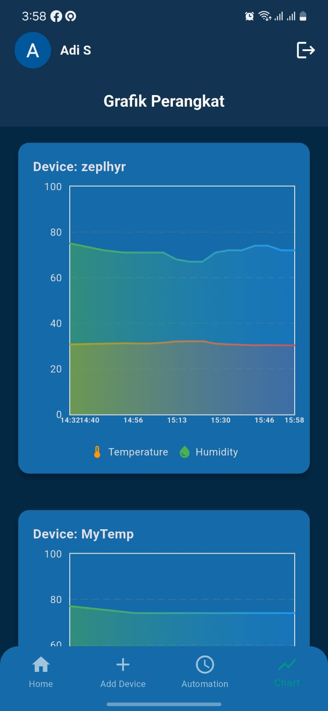
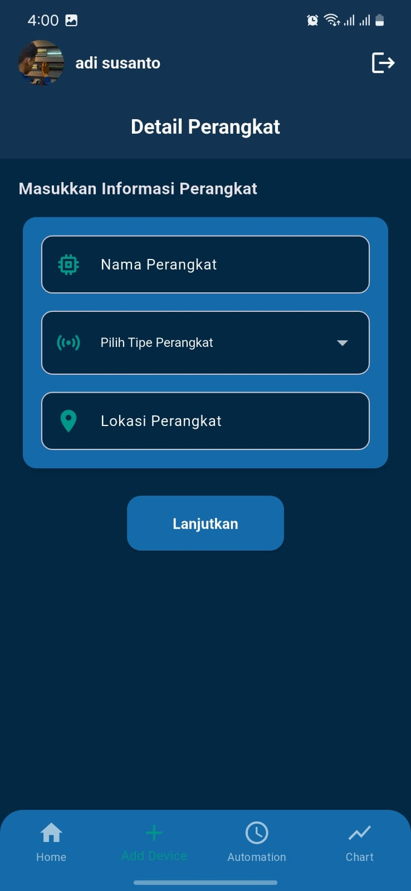
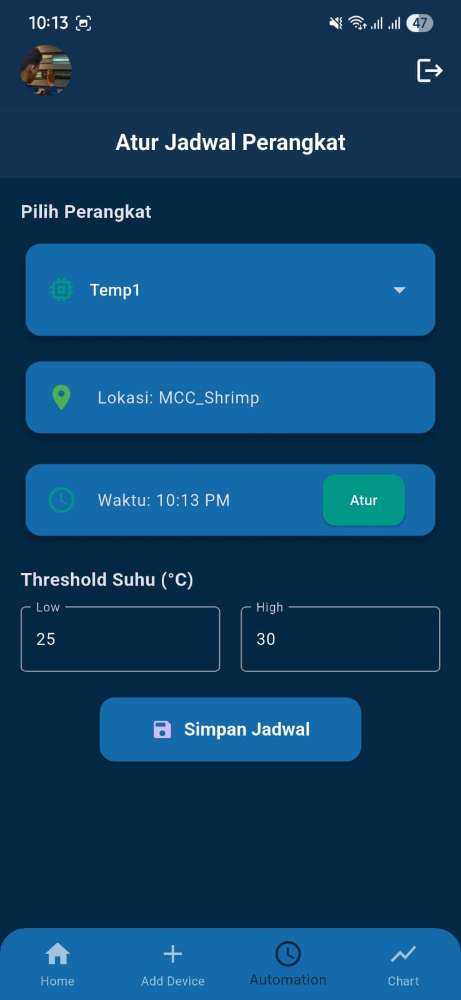
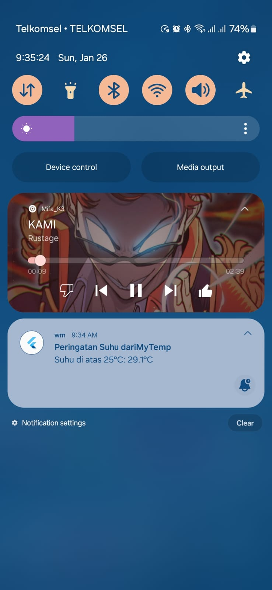
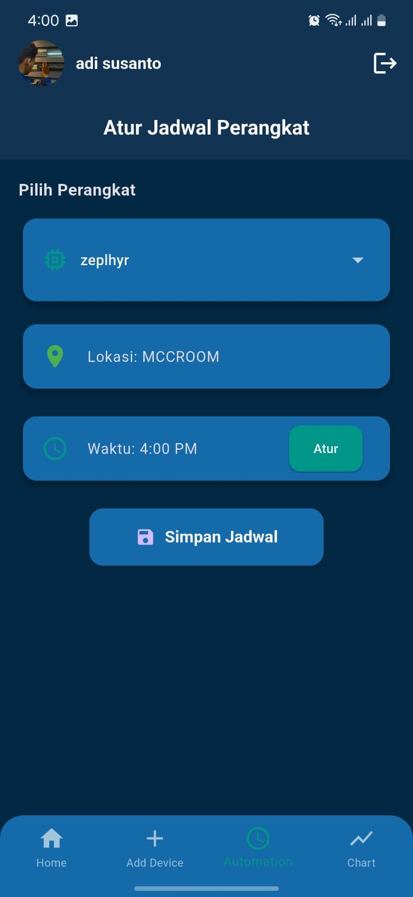
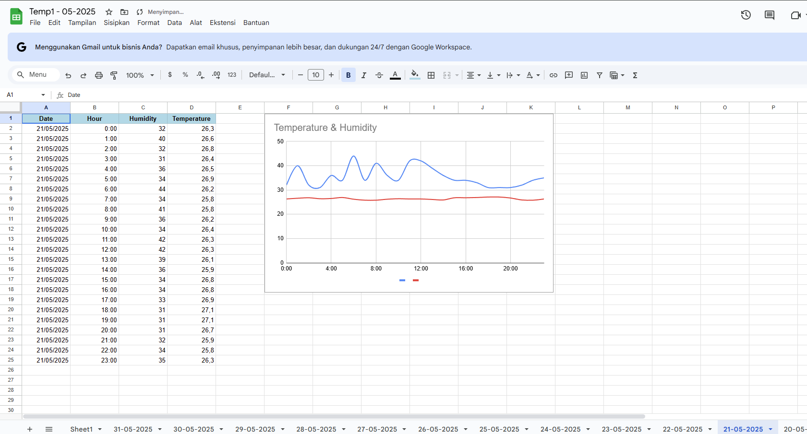

# 🌡️ Smart Temperature/Humidity Monitor  

Sistem pemantauan suhu dan kelembapan berbasis **IoT**, dirancang untuk penggunaan di **gudang**, **ruang panel**, dan **ruang server**. Alat ini memonitor suhu dan kelembapan secara otomatis, mengirimkan **notifikasi saat suhu melebihi batas**, serta mencatat data suhu ke **Google Sheets** yang terintegrasi dengan akun Google Anda.
> 💡 **Solusi ini cocok untuk Anda yang ingin sistem monitoring suhu yang praktis, hemat daya, dan terhubung ke cloud. Cocok untuk industri, teknisi, hingga pemilik usaha kecil.**
---

## 🔧 Fitur Utama

- ✅ Pemantauan suhu dan kelembapan
- ✅ Push notifikasi saat suhu melewati batas atas/bawah
- ✅ Aplikasi Android dengan grafik suhu real-time
- ✅ WiFi provisioning langsung dari aplikasi
- ✅ Pengaturan batas suhu dan jadwal pengiriman data ke GoogleSheets
- ✅ Google Sheets otomatis berisi tabel & grafik suhu
- ✅ Login Google untuk akses data pribadi dan aman

---

## 📱 Cara Kerja

1. **Pertama kali digunakan**, alat akan masuk ke mode WiFi provisioning dan dikonfigurasi melalui aplikasi Android.
2. Setelah tersambung ke WiFi, alat mulai **mengambil data suhu**.
3. **Aplikasi Android** akan menampilkan data suhu dalam bentuk **grafik 20 titik terakhir**, serta menyediakan pengaturan batas suhu & jadwal.
4. Jika suhu di luar batas yang ditentukan, **notifikasi langsung dikirim ke smartphone** Anda.
5. Setiap hari pada waktu tertentu, data suhu dikirim otomatis ke **Google Sheets** yang terhubung ke akun Google pengguna.
6. Google Sheets menyusun data ke dalam **tabel yang mudah dibaca**, lengkap dengan **grafik suhu historis**.

---

## 🎯 Cocok Untuk

- 🏭 **Gudang penyimpanan** — mencegah kerusakan akibat suhu ekstrem
- ⚡ **Ruang panel listrik** — deteksi dini overheating peralatan
- 🖥️ **Ruang server** — menjaga suhu stabil demi operasional sistem
- 📦 Lokasi sensitif lainnya yang butuh pemantauan suhu

---

## 📷 Gambar Perangkat

---

### 📱 Tampilan Aplikasi Android

<table>
  <tr>
    <td align="center">
       
      <b>Login Google</b>
    </td>
    <td align="center">
       
      <b>WiFi Provisioning</b>
    </td>
    <td align="center">
       
      <b>Dashboard</b>
    </td>
    <td align="center">
       
      <b>Grafik Suhu</b>
    </td>
  </tr>
  <tr>
    <td align="center">
       
      <b>Manajemen Perangkat</b>
    </td>
    <td align="center">
       
      <b>Pengaturan Jadwal</b>
    </td>
    <td align="center">
       
      <b>Notifikasi</b>
    </td>
    <td align="center">
       
      <b>Automasi</b>
    </td>
  </tr>
</table>

---

## 📊 Contoh Output Google Sheets

---

## 📣 Ingin Tahu Lebih Lanjut?

Tertarik dengan sistem monitoring suhu ini?  
Punya ide pengembangan, ingin bekerja sama, atau sekadar ingin tahu lebih banyak?

> 

Saya terbuka untuk kolaborasi, pengembangan produk, atau implementasi di berbagai kebutuhan industri dan komersial.

---

## 📄 Lisensi

Proyek ini berada di bawah lisensi MIT.  
Bebas digunakan dan dimodifikasi — mohon tetap mencantumkan atribusi.

---
